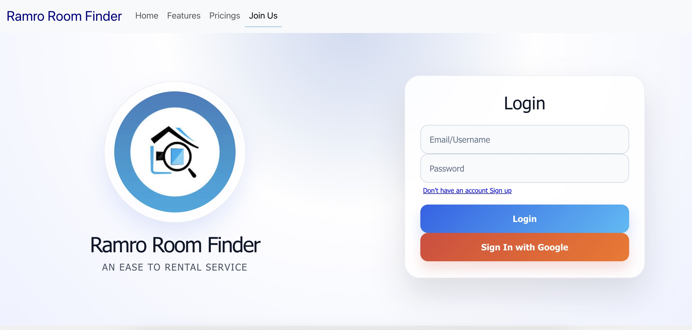
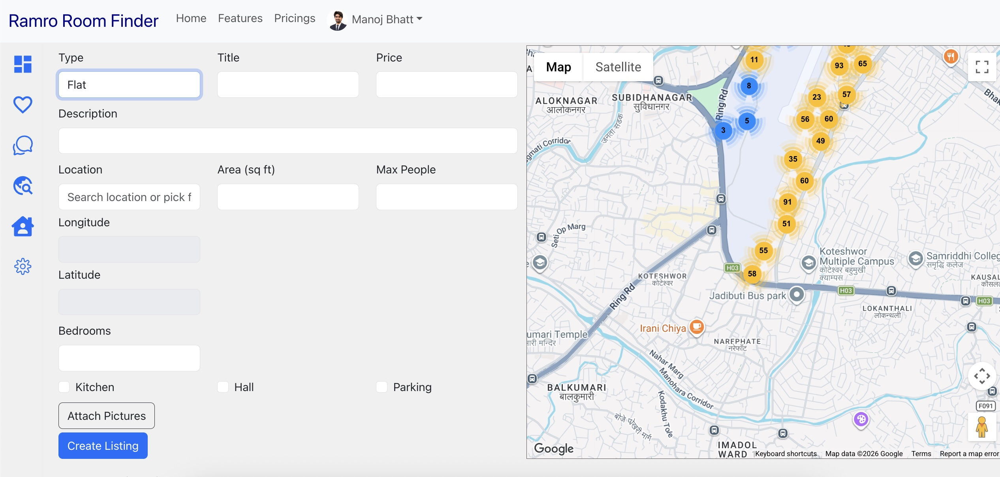
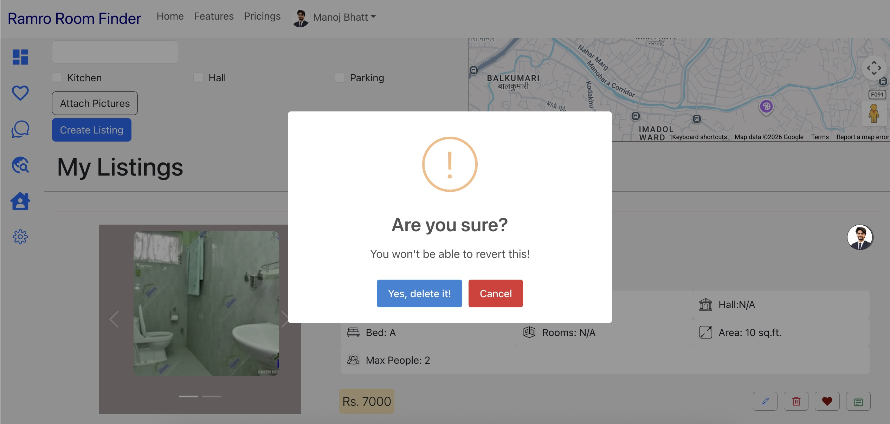
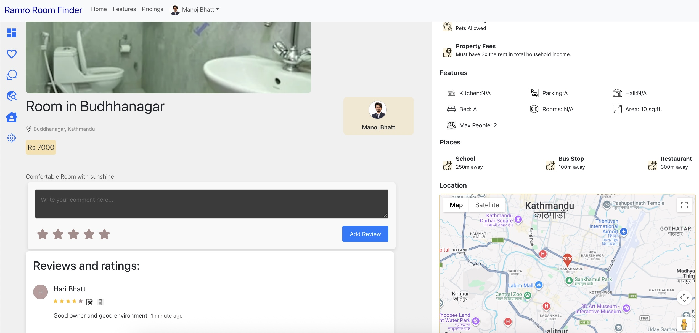
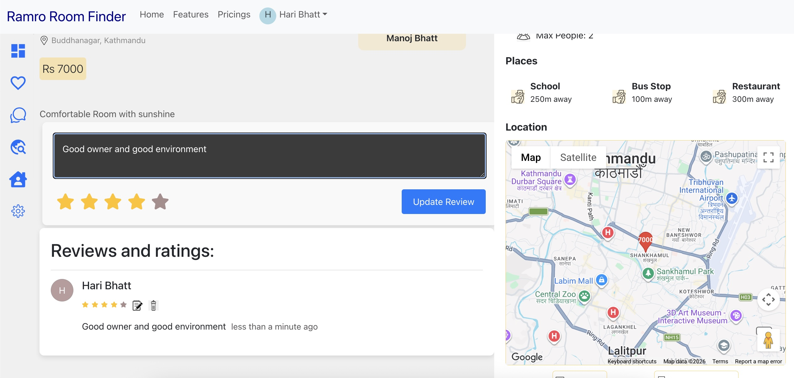
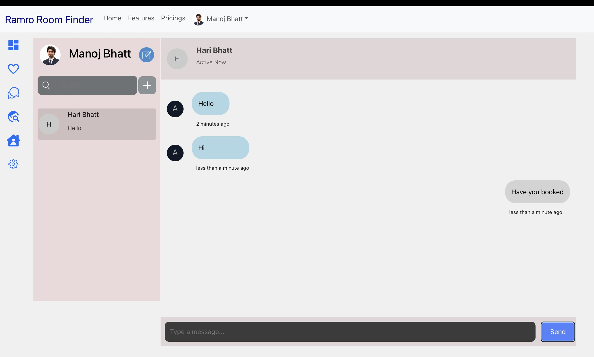

# Room Finder

A full-stack room finder application that helps users discover rooms and locations using Google Maps services. The application includes authentication, Google Sign-In, REST APIs, real-time chat, and database integration.

## 📸 Screenshots

### Home Page



### Listings add update delete detailview





### Listings Review


### Basic chat system



### Google Maps Integration


---

## 🚀 Features

* 🔐 User authentication
* 🔵 Google Sign-In authentication
* 🏠 Room finding and listing
* 🗺️ Google Maps integration
* 📍 Location-based room discovery
* 💬 Chat system
* 🔌 REST API integration
* 🗄️ Database integration
* ⚡ Vite-powered React frontend
* 🖥️ Express.js backend
* 📱 Responsive user interface

---

## 🛠️ Tech Stack

### Frontend

* React
* Vite
* JavaScript
* HTML5
* CSS3

### Backend

* Node.js
* Express.js
* REST API

### Services & Integration

* Google Maps Services
* Google Sign-In
* Database
* Authentication

---

## 📁 Project Structure

```text
room-finder/
│
├── frontend/
│   ├── src/
│   ├── public/
│   ├── package.json
│   └── ...
│
├── backend/
│   ├── src/
│   ├── package.json
│   └── ...
│
├── media/

├── .gitignore
└── README.md
```

---

## ⚙️ Getting Started

### 1. Clone the Repository

```bash
git clone <your-repository-url>
cd ramro-room-finder-prototype
```

### 2. Start the Backend

Open a terminal and navigate to the backend folder:

```bash
cd backend
```

Install the dependencies:

```bash
npm install
```

Start the development server:

```bash
npm run dev
```

The backend server should now be running.

---

### 3. Start the Frontend

Open another terminal and navigate to the frontend folder:

```bash
cd frontend
```

Install the dependencies:

```bash
npm install
```

Start the Vite development server:

```bash
npm run dev
```

Vite will provide a local development URL in the terminal, usually:

```text
http://localhost:5173
```

---

## 🔐 Authentication

The application provides user authentication through the backend REST API.

Authentication features include:

* User registration
* User login
* Authentication
* Google Sign-In
* Protected application features

---

## 💬 Chat System

The application includes a chat system that allows users to communicate within the platform.

The chat functionality is integrated with the backend and database to manage conversation-related data.

---

## 🔌 REST API

The Express.js backend provides REST APIs for communication between the frontend and backend.

The API handles functionality such as:

* Authentication
* User management
* Room data
* Location-related data
* Chat functionality
* Database operations

---

## 🗄️ Database Integration

The backend is connected to a database for persistent storage of application data.

Database operations are handled through the Express.js backend and exposed to the frontend through REST APIs.

---

## 🔄 Application Flow

```text
                    ┌──────────────────┐
                    │   React + Vite   │
                    │    Frontend      │
                    └────────┬─────────┘
                             │
                             │ REST API
                             ▼
                    ┌──────────────────┐
                    │   Express.js     │
                    │     Backend      │
                    └───────┬───┬──────┘
                            │   │
                ┌───────────┘   └────────────┐
                ▼                            ▼
        ┌──────────────┐             ┌──────────────┐
        │   Database   │             │ Google Maps  │
        └──────────────┘             │   Services   │
                                     └──────────────┘
```

---

## ▶️ Development

Run the backend and frontend in separate terminals.

### Terminal 1 — Backend

```bash
cd backend
npm run dev
```

### Terminal 2 — Frontend

```bash
cd frontend
npm run dev
```

Both servers need to be running for the complete application to work.

---

## 📌 Future Improvements

* Advanced room filtering
* Room recommendations
* Improved real-time messaging
* Room bookmarking
* Notifications
* Improved location-based search

---

## 👨‍💻 Author

**Manoj Bhatt**

---

## 📄 License

This project is for educational and portfolio purposes.
